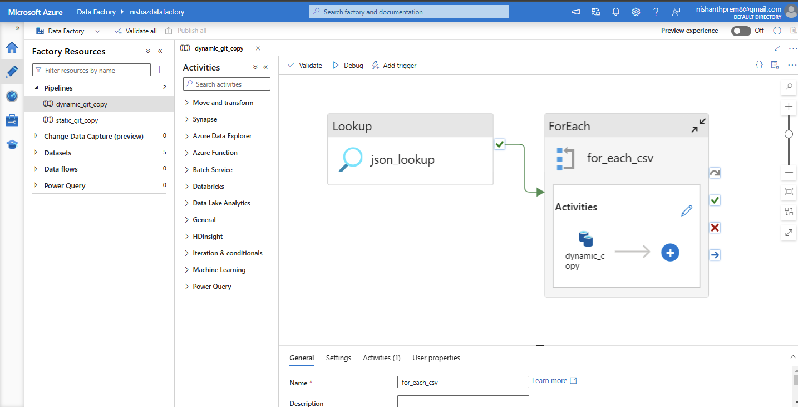

# Azure Data Pipeline Project

## Overview
This project demonstrates the implementation of a robust Azure Data Pipeline to automate data ingestion, transformation, and visualization. The pipeline integrates data from GitHub into Azure Data Lake using Azure Data Factory, transforms the data in Azure Databricks, and makes it available for analytics in Azure Synapse Analytics. Finally, the processed data is visualized in Power BI to enable insightful reporting and data-driven decision-making.

---

## Key Features

1. **Automated Data Ingestion**
   - Utilized **Azure Data Factory** to fetch data dynamically from GitHub.
   - Automated workflows to ensure efficient and seamless data ingestion into **Azure Data Lake**.

2. **Data Transformation**
   - Leveraged **Azure Databricks** for data transformation.
   - Converted raw data into **Parquet format** for optimized storage and analytics.
   - Pushed the transformed data back into Azure Data Lake.

3. **Data Analytics and Visualization**
   - Created **views and external tables** in **Azure Synapse Analytics** for querying and analytics.
   - Visualized the processed data using **Power BI**, enabling interactive dashboards and meaningful insights.

---

## Architecture

### Data Flow
1. Data is ingested from GitHub into Azure Data Lake via Azure Data Factory.
2. Azure Databricks processes and transforms the data into Parquet format.
3. Transformed data is stored back in Azure Data Lake.
4. Azure Synapse Analytics is used to create external tables and views for the processed data.
5. Power BI connects to Azure Synapse to visualize the data for end users.

### Azure Services Used
- **Azure Data Factory**: For data orchestration and ingestion.
- **Azure Data Lake**: For scalable data storage.
- **Azure Databricks**: For data transformation and processing.
- **Azure Synapse Analytics**: For analytics and querying.
- **Power BI**: For data visualization and reporting.

---

## Prerequisites
To run this project, ensure you have the following:
- Azure Subscription.
- Access to a GitHub repository for data ingestion.
- Azure Data Lake, Databricks, and Synapse Analytics services provisioned.
- Power BI Desktop installed for visualization.

---

## Setup Instructions

### 1. Data Ingestion
- Create a pipeline in **Azure Data Factory** to pull data from GitHub using REST API connectors.
- Configure linked services and datasets to connect to GitHub and Azure Data Lake.
- Schedule the pipeline for periodic execution.

### 2. Data Transformation
- Set up a **Databricks cluster** in Azure.
- Write and execute a Databricks notebook to:
  - Read data from Azure Data Lake.
  - Perform necessary transformations.
  - Save the processed data in Parquet format back to Azure Data Lake.

### 3. Data Analytics
- Use **Azure Synapse Analytics** to:
  - Create external tables pointing to the Parquet files in Azure Data Lake.
  - Design views for aggregated or refined data analysis.

### 4. Data Visualization
- Connect **Power BI** to Azure Synapse Analytics.
- Create interactive dashboards to visualize trends, patterns, and insights.

---

## Project Deliverables
- An automated pipeline for data ingestion from GitHub to Azure Data Lake.
- Transformed data stored in Parquet format for optimized analytics.
- Queryable datasets in Azure Synapse Analytics.
- Power BI dashboards providing actionable insights.

---

## Use Cases
- **Data Integration**: Efficiently ingest and integrate data from external sources.
- **Data Transformation**: Apply transformations for storage and analytics optimization.
- **Analytics and Reporting**: Enable business intelligence and decision-making through visualization.

---

## Future Enhancements
- Implement real-time data ingestion using Azure Event Hubs or Stream Analytics.
- Integrate machine learning models in Databricks for advanced analytics.
- Optimize Power BI dashboards for mobile compatibility.

---

## Contact
For questions or further information, please contact:
**Nishanth Prem**  
Email: nishanthprem8@gmail.com

